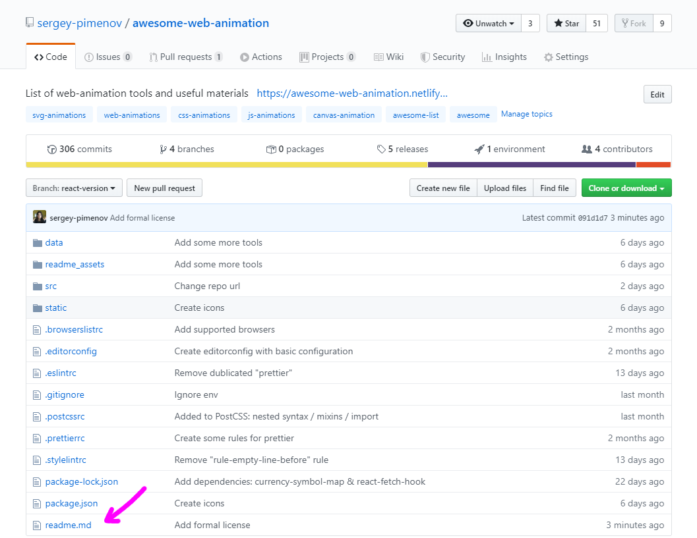
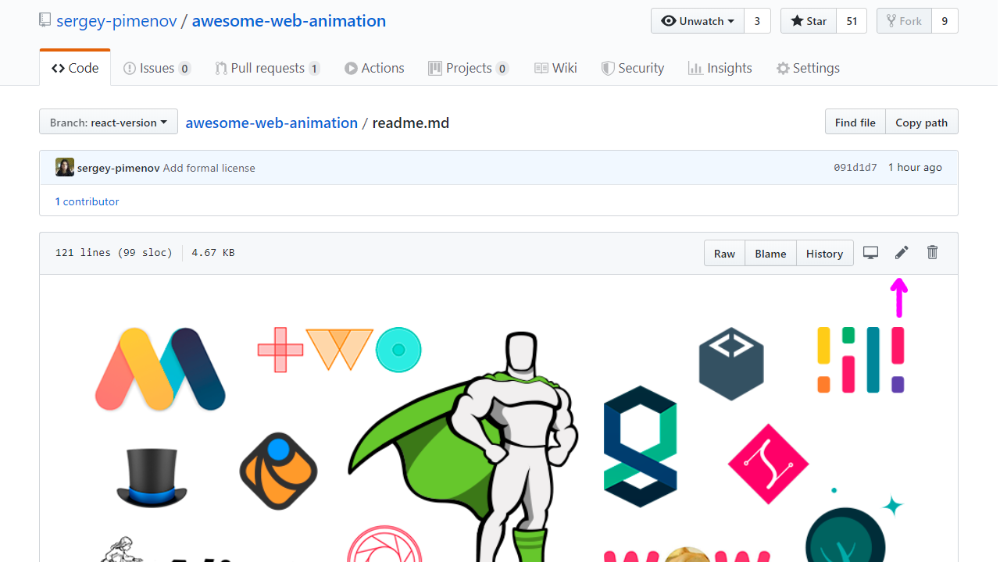
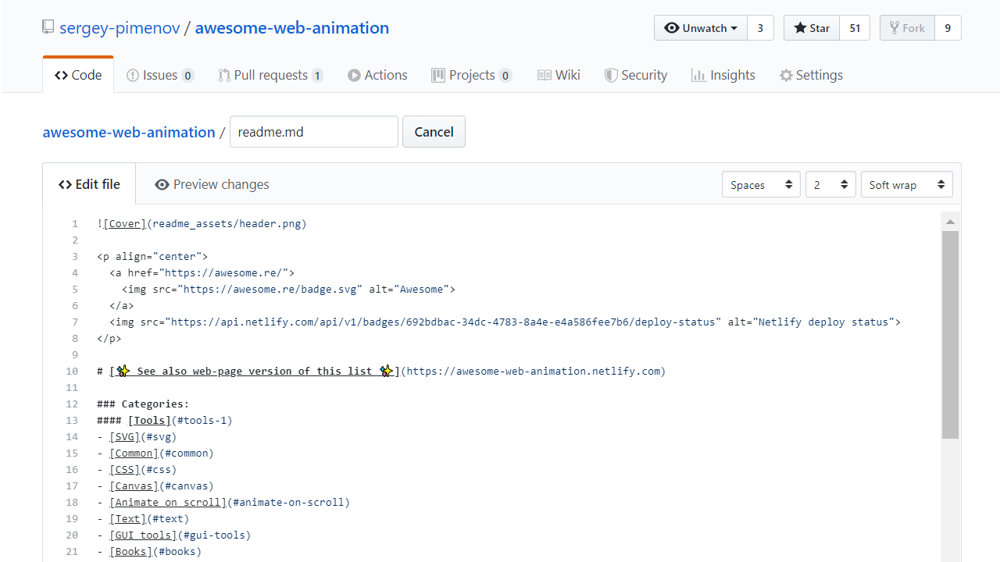

## Adding something to an awesome list

If you have something awesome to contribute to an awesome list, this is how you do it.

1. Click on the `readme.md` file: 

2. Now click on the edit icon.

3. You can start editing the text of the file in the in-browser editor. Make sure you follow guidelines above. You can use [GitHub Flavored Markdown](https://help.github.com/articles/github-flavored-markdown/).

4. Submit the pull request
