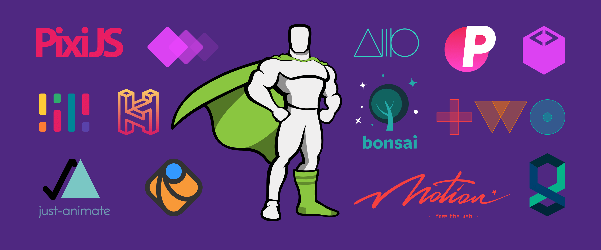
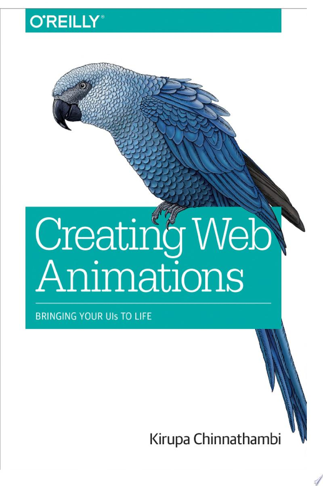
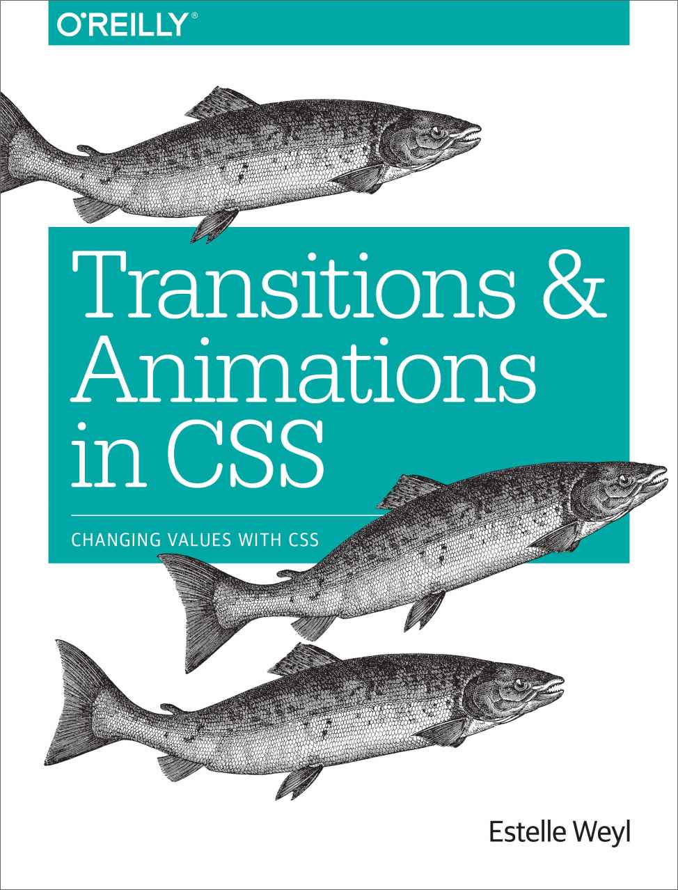
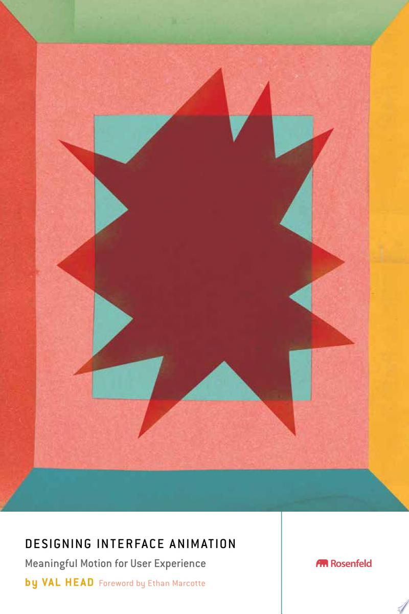
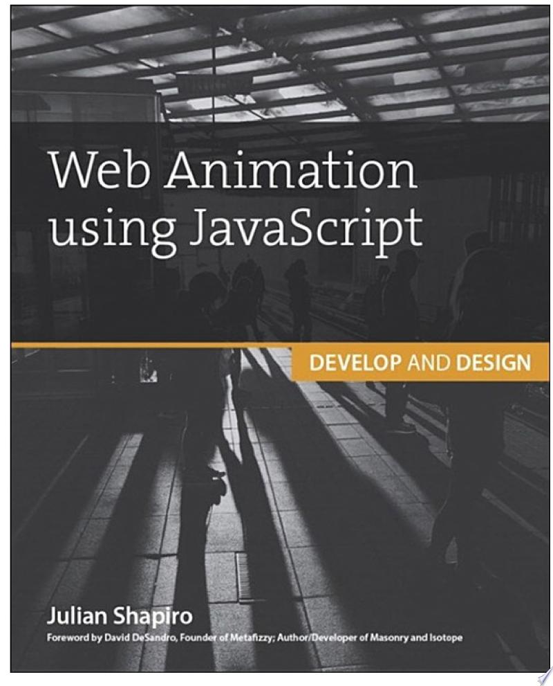
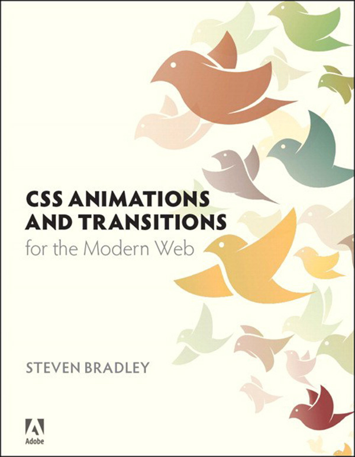
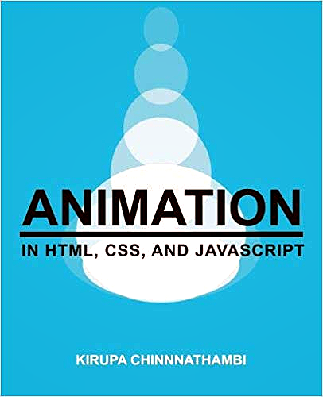
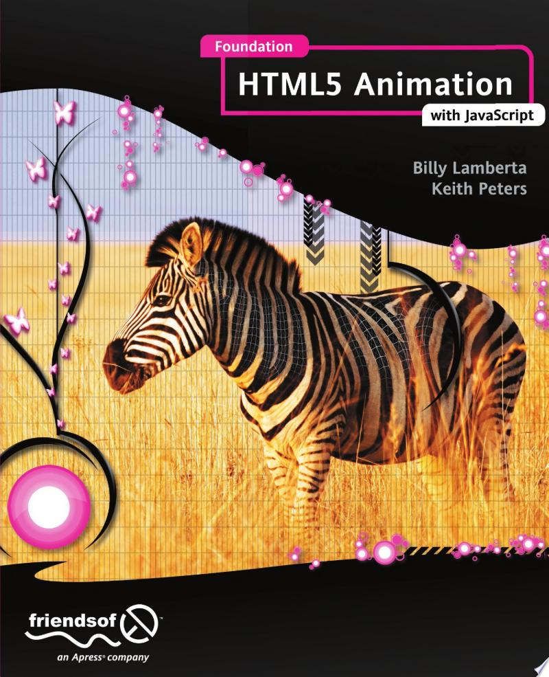

# Awesome Web Animation 

This list contains the most useful tools and data for creating web animations.
* Any libraries that help animate anything in the browser - Canvas, SVG, text, scroll etc.
* Books about animation in the browser.
* GUI tools for animation that can be exported to the browser.

## Contents
- [SVG](#svg)
- [Common](#common)
- [CSS](#css)
- [Canvas](#canvas)
- [Animate on scroll](#animate-on-scroll)
- [Text](#text)
- [GUI tools](#gui-tools)
- [React](#react)
- [Books](#books)

## SVG

- [Snap.svg](https://github.com/adobe-webplatform/Snap.svg) - The JavaScript library for modern SVG graphics.
- [Svg.js](https://github.com/svgdotjs/svg.js) - The lightweight library for manipulating and animating SVG.
- [Vivus](https://github.com/maxwellito/vivus) - Library to make drawing animation on SVG.
- [Walkway](https://github.com/ConnorAtherton/walkway) - An easy way to animate SVG elements.
- [Raphael](https://github.com/DmitryBaranovskiy/raphael) - JavaScript Vector Library.
- [Bonsai](https://github.com/uxebu/bonsai) - BonsaiJS is a graphics library and renderer.

## Common

- [GSAP](https://github.com/greensock/GSAP) - JavaScript animation library.
- [TweenJS](https://github.com/CreateJS/TweenJS) - A simple but powerful tweening / animation library for JavaScript. Part of the CreateJS suite of libraries.
- [Anime.js](https://github.com/juliangarnier/anime) - JavaScript animation engine.
- [Mojs](https://github.com/mojs/mojs) - The motion graphics toolbelt for the web.
- [Animo.js](https://github.com/ThrivingKings/animo.js) - A powerful little tool for managing CSS animations.
- [Move.js](https://github.com/visionmedia/move.js) - CSS3 backed JavaScript animation framework.
- [Velocity](https://github.com/julianshapiro/velocity) - Accelerated JavaScript animation.
- [Animateplus](https://github.com/bendc/animateplus) - A+ animation module for the modern web.
- [Animatic](https://github.com/lvivski/animatic) - CSS animations engine.
- [Just Animate](https://github.com/just-animate/just-animate) - Making Animation Simple.
- [Haiku Core](https://github.com/HaikuTeam/core) - Interactive UI animation engine for the Web. Core renderer for Haiku Animator.
- [Between.js](https://github.com/sasha240100/between.js) - Lightweight JavaScript (ES6) tweening engine.
- [Progressbar.js](https://github.com/kimmobrunfeldt/progressbar.js) - Responsive and slick progress bars.
- [Bezier easing](https://github.com/gre/bezier-easing) - Cubic-bezier implementation for your JavaScript animation easings.
- [Glsl easings](https://github.com/glslify/glsl-easings) - Easing functions in GLSL.
- [ES6-tween](https://github.com/tweenjs/es6-tween) - ES6 version of tween.js.

## CSS

- [Animate.css](https://github.com/daneden/animate.css) -  A cross-browser library of CSS animations. As easy to use as an easy thing.
- [Motion-ui](https://github.com/foundation/motion-ui) - The powerful Sass library for creating CSS transitions and animations.
- [Magic](https://github.com/miniMAC/magic) - CSS3 Animations with special effects.
- [Css-loaders](https://github.com/lukehaas/css-loaders) - A collection of loading spinners animated with CSS.
- [SpinKit](https://github.com/tobiasahlin/SpinKit) - A collection of loading indicators animated with CSS.
- [Bounce.js](https://github.com/tictail/bounce.js) - Create beautiful CSS3 powered animations in no time.

## Canvas

- [EaselJS](https://github.com/CreateJS/EaselJS) - EaselJS is a library for building high-performance interactive 2D content in HTML5.
- [Fabric.js](https://github.com/fabricjs/fabric.js) - JavaScript canvas library with animation support.
- [Paper.js](https://github.com/paperjs/paper.js) - The Swiss Army Knife of Vector Graphics Scripting – Scriptographer ported to JavaScript and the browser, using HTML5 Canvas.
- [Konva](https://github.com/konvajs/konva) - Konva.js is an HTML5 Canvas JavaScript framework that extends the 2d context by enabling canvas interactivity for desktop and mobile applications.
- [Two.js](https://github.com/jonobr1/two.js) - A renderer agnostic two-dimensional drawing api for the web with animation support.
- [Ocanvas](https://github.com/koggdal/ocanvas) - JavaScript library for object-based canvas drawing.
- [Curtainsjs](https://github.com/martinlaxenaire/curtainsjs) - Lightweight vanilla WebGL JavaScript library that turns HTML DOM elements into interactive textured planes.
- [Hover-effect](https://github.com/robin-dela/hover-effect) - JavaScript library to draw and animate images on hover.

## Animate on scroll

- [AOS](https://github.com/michalsnik/aos) - Animate on scroll library.
- [Laxxx](https://github.com/alexfoxy/laxxx) - Simple & light weight (3kb minified & zipped) vanilla JavaScript plugin to create smooth & beautiful animations when you scrolllll!
- [Wow](https://github.com/matthieua/WOW) - Reveal CSS animation as you scroll down a page.
- [Scrollreveal](https://github.com/scrollreveal/scrollreveal) - Animate elements as they scroll into view.
- [ScrollMagic](https://github.com/janpaepke/ScrollMagic) - The JavaScript library for magical scroll interactions.
- [Motus](https://github.com/alexcambose/motus) - Animation library that mimics CSS keyframes when scrolling.
- [Sal](https://github.com/mciastek/sal) - Performance focused, lightweight scroll animation library.

## Text

- [Malarkey](https://github.com/yuanqing/malarkey) - Simulate a typewriter effect in vanilla JavaScript.
- [Typed.js](https://github.com/mattboldt/typed.js) - A JavaScript Typing Animation Library.
- [Shuffle-text](https://github.com/ics-ikeda/shuffle-text) - Shuffle-text is JavaScript text effect library such as cool legacy of Flash.
- [Typebot](https://github.com/akzhy/typebot) - JavaScript library for typing animation.
- [Blotter](https://github.com/bradley/Blotter) - A JavaScript API for drawing unconventional text effects on the web.

## React

- [Motion](https://github.com/framer/motion) - Open source, production-ready animation and gesture library for React.
- [SVGR](https://github.com/gregberge/svgr) - Transform SVGs into React components.

## GUI tools

- [Svgartista](https://svgartista.net/) - SVG Artista is a tool that helps you animate stroke and fill properties in your SVG images with plain CSS code. It should work fine with path, line, polyline, rect, circle, ellipse and polygon elements. It cannot animate SVG gradients though, so please keep that in mind.
- [Mantra](https://jeremyckahn.github.io/mantra/) - Mantra is a timeline editing tool for web animations. It is inspired by tools such as Adobe Flash and After Effects.
- [Animista](https://animista.net/) - Animista is a place where you can play with a collection of pre-made css animations, tweak them and get only those you will actually use.
- [Cssanimate](http://cssanimate.com/) - Welcome to CssAnimate.com, tool for easy and fast creating CSS3 keyframes animation, right in your browser without using any desktop software. If you want to render complex and consistent CSS3 animation on your site this tool is made for you! You can create complex CSS3 keyframe animation without any coding and to get ready made css styles for using on your site.
- [Ceaser](https://matthewlein.com/tools/ceaser) - Now that we can use CSS transitions in all the modern browsers, let's make them pretty. I love the classic Penner equations with Flash and jQuery, so I included most of those. If you're anything like me*, you probably thought this about the default easing options: “ease-in, ease-out etc.” The mysterious cubic-bezier has a lot of potential, but was cumbersome to use. Until now. Also, touch-device friendly!
- [Cubic Bezier](https://cubic-bezier.com/) - A great utility for creating Bezier curves. You can import and export curves to/from your library to share them with others.
- [Keyframer](http://alexberg.in/keyframer/) - Tool that help visualize animation components and output the code required.
- [CSS Animation Kit](http://angrytools.com/css/animation/) - Select any predefined samples from top panel. Below samples there is a timeline of @keyframes. Timeline has 101 keyframes ( 0% to 100%) direction from left to right. Highlighted keyframe indicate that some style is assigned to that point. You can add new style at selected point.

## Books

### [SVG animation](https://www.amazon.com/SVG-Animations-Implementations-Responsive-Animation/dp/1491939702)

&nbsp;

SVG is extremely powerful, with its reduced HTTP requests and crispness on any display. It becomes increasingly more interesting as you explore its capabilities for responsive animation and performance boons. When you animate SVG, you must be aware of normal image traits like composition, color, implementation, and optimization. But when you animate, it increases the complexity of each of these factors exponentially.

### [Creating Web Animations: Bringing Your UIs to Life](https://www.amazon.com/Creating-Web-Animations-Bringing-Your/dp/1491957514/)

&nbsp;

Thanks to faster browsers, better web standards support, and more powerful devices, the web now defines the next generation of user interfaces that are fun, practical, fluid, and memorable. The key? Animation. But learning how to create animations is hard, and existing learning material doesnt explain the context of the UI problem that animations are trying to solve. Thats where this book comes in.

### [Transitions and Animations in CSS: Adding Motion with CSS](https://www.amazon.com/Transitions-Animations-CSS-Adding-Motion/dp/149192988X/)

Add life and depth to your web applications and improve user experience through the discrete use of CSS transitions and animations. With this concise guide, you'll learn how to make page elements move or change in appearance, whether you want to realistically bounce a ball, gradually expand a drop-down menu, or simply bring attention to an element when users hover over it.

### [Designing Interface Animation: Meaningful Motion for User Experience](https://www.amazon.com/Designing-Interface-Animation-Meaningful-Experience/dp/1933820322/)

Effective interface animation deftly combines form and function to improve feedback, aid in orientation, direct attention, show causality, and express your brands personality. Designing Interface Animation shows you how to create web animation that balances purpose and style while blending seamlessly into the users experience. This book is a crash course in motion design theory and practice for web designers, UX professionals, and front-end developers alike.

### [Web Animation using JavaScript: Develop & Design](https://www.amazon.com/Web-Animation-using-JavaScript-Develop/dp/0134096665)

We\'ve come a long way since the days of flashing banner ads and scrolling news tickers. Today, the stunning motion design of iOS and Android dramatically improves a users experience — instead of detracting from it. The best sites and apps of today leverage animation to improve the feel and intuitiveness of their interfaces. Sites without animation are starting to feel antiquated. This book provides you with a technical foundation to implement animation in a way thats both visually stunning and programmatically maintainable.

### [CSS Animations and Transitions for the Modern Web](https://www.amazon.com/gp/product/0133980502/)

Modern websites use a variety of animated effects not only to improve usability but also to delight and surprise users. Some of these effects require complex scripting or programming skills, but many are within the grasp of designers who are already familiar with CSS and HTML. CSS Animations and Transitions for the Modern Web shows designers how to add movement to web pages over time using CSS3 style definitions.

### [Animation in HTML, CSS, and JavaScript](https://www.amazon.com/Animation-HTML-JavaScript-Kirupa-Chinnathambi/dp/1502548704)

This book will help you create practical / usable / wickedly-cool animations in HTML, CSS, and JavaScript. Each chapter is filled with cleanly explained concepts, beautifully illustrated diagrams, colorific code snippets, and cringeworthy one-liners guaranteed to make your friend who laughs at everything groan. You will start by learning how to create animations and transitions in CSS. Towards the end, you will learn how to create animations in JavaScript by manipulating DOM elements as well as pushing pixels on the canvas.

### [Foundation HTML5 Animation with JavaScript](https://www.amazon.com/Foundation-HTML5-Animation-JavaScript-Lamberta/dp/1430236655/)

Foundation HTML5 Animation with JavaScript covers everything that you need to know to create dynamic scripted animation using the HTML5 canvas. It provides information on all the relevant math you'll need, before moving on to physics concepts like acceleration, velocity, easing, springs, collision detection, conservation of momentum, 3D, and forward and inverse kinematics. Foundation HTML5 Animation with JavaScript is a fantastic resource for all web developers working in HTML5 or switching over from Flash to create standards-compliant games, applications, and animations that will work across all modern browsers and most mobile devices, including iPhones, iPads, and Android devices. -->

<h3 align="center">✨<a href="https://awesome-web-animation.netlify.com"> See also web page version of this list </a>✨</h3>

  

